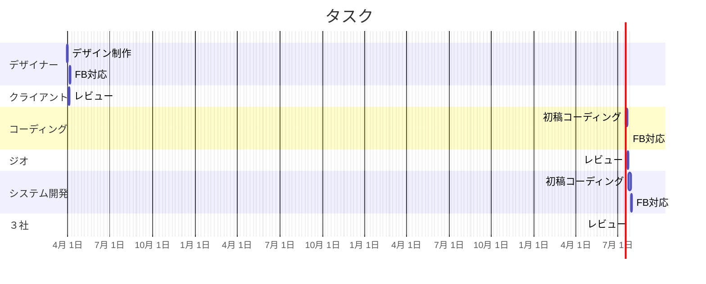
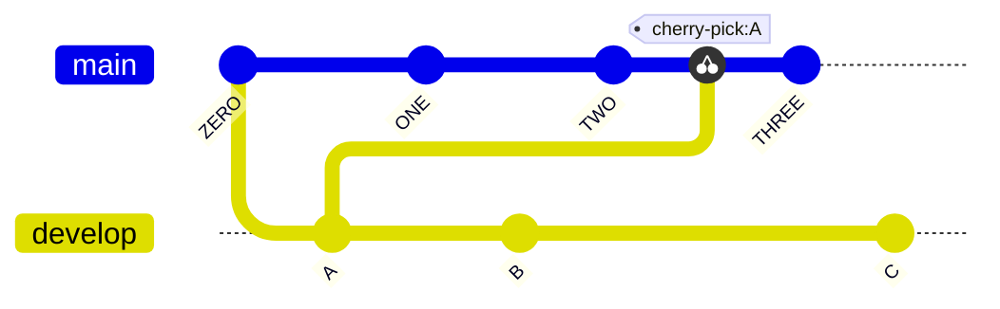
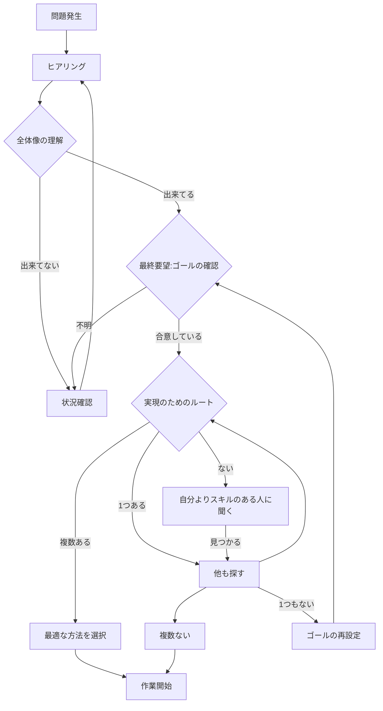

内容の変更
# test

```mermaid
gantt
	title タスク
	dateFormat  YYYY-MM-DD
	axisFormat %_m%月%e%日%
	excludes weekends
		section デザイナー
			デザイン制作:d1, 2023-03-30,2d
			FB対応:d2,after cl1,1d
		section クライアント
			レビュー:cl1,after d1, 2d
		section コーディング
			初稿コーディング:f1,after a2, 3d
			FB対応:f2,after cl2,1d
		section ジオ
			レビュー:cl2,after f1,1d
		section システム開発
			初稿コーディング:b1,after f2, 3d
			FB対応: after cl3,1d
		section ３社
			レビュー:cl3,after b1,1d
```
---
faerta

```mermaid
gitGraph
        commit id: "ZERO"
        branch develop
        commit id:"A"
        checkout main
        commit id:"ONE"
        checkout develop
        commit id:"B"
        checkout main
        commit id:"TWO"
        cherry-pick id:"A"
        commit id:"THREE"
        checkout develop
        commit id:"C"

```

```mermaid
flowchart TD
問題発生 --> ヒアリング --> point1{全体像の理解}
point1 --出来てる--> point2{最終要望:ゴールの確認}
point1 --出来てない--> 状況確認 -->ヒアリング
point2 --合意している-->point3{実現のためのルート}
point2 --不明-->状況確認
point3　--1つある-->他も探す-->point3
point3 --複数ある-->最適な方法を選択-->作業開始
point3 --ない-->自分よりスキルのある人に聞く--見つかる-->他も探す-->複数ない-->作業開始
他も探す --1つもない--> ゴールの再設定 -->point2

```